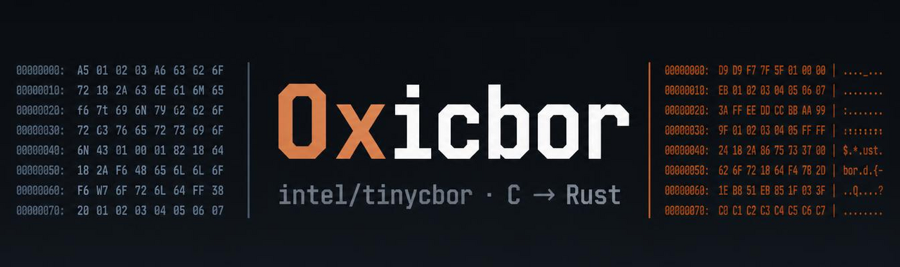

<div align="center">



### Concise Binary Object Representation (CBOR) Library

**A line-for-line port of [intel/tinycbor](https://github.com/intel/tinycbor) from C to Rust,
linkable as a drop-in `libtinycbor.a`.**

The original Qt test suite runs against it unmodified.

[Documentation](https://keirsalterego.github.io/0xicbor/) ·
[Decisions](decisions.md) ·
[Benchmarks](bench/methodology.md)

</div>

---

## What this is

tinycbor is Intel's CBOR (RFC 8949) implementation: about 6,500 lines of C, aimed at
microcontrollers, with no allocations on the common path. This is that library rewritten in
Rust, keeping the C ABI byte for byte so existing callers do not notice the swap.

The proof is the test suite. `tests/original/` holds upstream's Qt tests copied verbatim,
with their SHA-256 hashes pinned at kickoff. They are compiled and linked against the Rust
static library with no edits. Whatever they report is what this port scores.

```
make        # builds libtinycbor.a and the original test binaries
make test   # runs them, prints per-binary pass/fail
```

## Status

The numbers below are the real output of `make test` and `bench/run.py`, not targets.

| | |
|---|---|
| **Original suite** | **4,929 / 4,929, zero failures** |
| **Symbol parity** | **44 / 44, zero `nm` diff** against upstream's `libtinycbor.a` |
| **ABI layout** | asserted against C-dumped sizes and offsets, passing |
| **Differential fuzz** | **1,507,421 execs, 901s, zero divergences** (one find, fixed) |
| **`unsafe` blocks** | **75**, all in `cbor-ffi`; `cbor-core` is `forbid(unsafe_code)` |
| **Dependencies** | **zero** |
| **Parsing speed** | **1.04x slower than C** (mean p50 over 8 corpus files) |

Every test in Intel's suite that can apply to a port passes. `tst_cpp` is the exception and
always was: it `#include`s upstream's `.c` files directly, so it tests C sources a Rust port
does not have. That is 2 rows, which is why the total is 4,929 and not 4,931, and it has its
own entry in [decisions.md](decisions.md) rather than being quietly dropped.

**The port is still slower at parsing than the C it replaces**, on five of the eight corpus
files: 0.87x to 1.22x, mean 1.04x. It was 1.49x until the byte source became a type
parameter instead of a runtime flag test; what is left is concentrated in the deeply nested
file. Startup costs 63 µs more, peak RSS runs 12-72% higher, and the static archive is far
larger. It wins pretty-printing by 2x to 32x, but that is upstream calling `vfprintf` once
per byte in `hexDump`, not decode speed, so it is not a headline worth claiming. Full
numbers, the flag experiments behind the fix, and the method are in
[bench/methodology.md](bench/methodology.md).

**The fuzzer did find a bug**, and it is worth saying so rather than quoting only the clean
run. Two runs at 60 and 121 seconds came back clean; a 15-minute run found a real divergence
at 420,793 executions, on a 1,220-byte input of deeply nested maps. The pretty printer had no
arm for `CborInvalidType` and reported that the input had run out, where upstream prints
`invalid` and reports the type. It is fixed, the input is a permanent fixture under
`tests/port/corpus/`, and the run above is the re-verification. The moral is in
[the fuzzing page](https://keirsalterego.github.io/0xicbor/verification/differential-fuzzing.html):
60 seconds is enough to claim you fuzzed, not enough to find anything.

For scale on the `unsafe` count: uv ships 73 blocks, Bun ships 13,044. Every one of the 75
here is in `cbor-ffi` dereferencing a pointer a C caller handed us, and each carries a
`// SAFETY:` line naming the invariant. `cbor-core`, which is the entire CBOR implementation, is
`#![forbid(unsafe_code)]` and contains none.

## How it fits together

```
crates/cbor-core/   the actual port: no_std + alloc, #![forbid(unsafe_code)]
crates/cbor-ffi/    the C ABI shim: staticlib, #[repr(C)], all unsafe lives here
crates/cbor-ffi/include/   the C headers callers compile against
tools/              cbordump and json2cbor, pure Rust rewrites
tests/original/     upstream's suite, verbatim, hash-pinned, never edited
tests/port/         tests for what upstream's suite does not reach, each one
                    built against both archives and diffed rather than against
                    an expected-output file that could drift
fuzz/               differential targets against an out-of-process C oracle
bench/              methodology, results, and the upstream reference build
```

Two constraints hold the design together.

**Layout parity.** `cbor.h` implements 59 of its 103 public functions as `static inline`
accessors that read struct fields directly. Those compile into the *caller*, not into the
library, so `CborValue`, `CborParser` and `CborEncoder` must match the C layout exactly or
the tests read garbage. The numbers were dumped from a C program at kickoff into
[`crates/cbor-ffi/abi-layout.txt`](crates/cbor-ffi/abi-layout.txt) and are asserted in a
Rust test.

**Symbol parity.** The remaining 44 functions are real exported symbols. `make symbols`
diffs `nm -g --defined-only` on this library against upstream's. The target is an empty
diff, and it currently is one.

## The C question

The shipped library contains no C. There is no `cc` crate, no `bindgen`, and nothing links
against upstream.

What *is* C, stated plainly:

- **The headers** in `crates/cbor-ffi/include/` are upstream's, vendored so a fresh clone
  builds without tinycbor checked out next door. They are the ABI contract. The `static
  inline` accessors in them compile into whatever program includes them, never into
  `libtinycbor.a`.
- **The fuzz oracle** is upstream's C library built as a separate binary. The differential
  fuzzer talks to it over a pipe as a subprocess. It is not FFI and it is not linked in.
- **`tests/original/`** is upstream's C++ test code, which is the entire point.

## Building

Needs a Rust toolchain, a C++ compiler, and Qt6 Test for the original suite.

```
make          # library + test binaries
make test     # run the original suite
make symbols  # diff exported symbols against upstream
make lint     # clippy, warnings denied
make fmt      # rustfmt check
```

To confirm the tests really are untouched:

```
cd tests/original && sha256sum -c hashes.txt
```

## License

MIT, matching upstream. Files under `tests/original/` remain
Copyright (C) 2025 Intel Corporation under their original MIT license.
